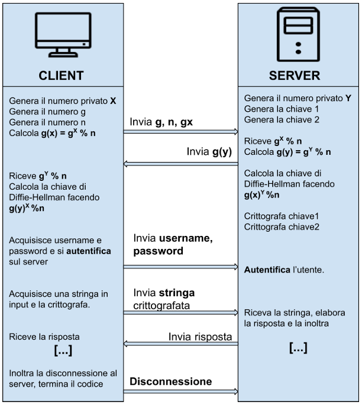

# 🔐 Encrypted Communication  

## 📌 Project Overview  
This project simulates **encrypted communication** between a client and a server.  

## ⚙️ Functionalities  
The application provides the following core functionalities:  
- **Asymmetric Encryption:** Implements the Diffie-Hellman algorithm to generate a shared secret key.  
- **Symmetric Encryption:** Encrypts communication using permutation and shuffling techniques based on the secret key.  
- **Database Authentication:** Users must log in to the server before communication; credentials are stored in a database.  

## 📡 Communication Schema  
  

## 🌍 Language  
- The system operates in **Italian**.  
- The code is written and commented in **Italian**.  

## ⚠️ Notes  
This project was developed for educational purposes only. We do not guarantee that all functionalities work flawlessly, and some errors may be present. The code could be further improved in terms of security and efficiency. Additionally, some comments may contain grammatical errors.  
